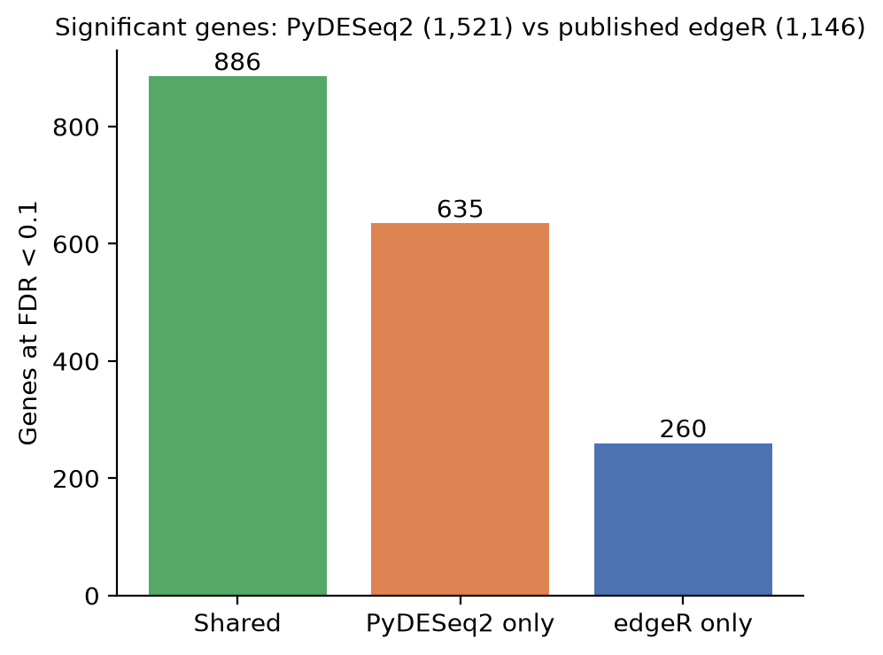
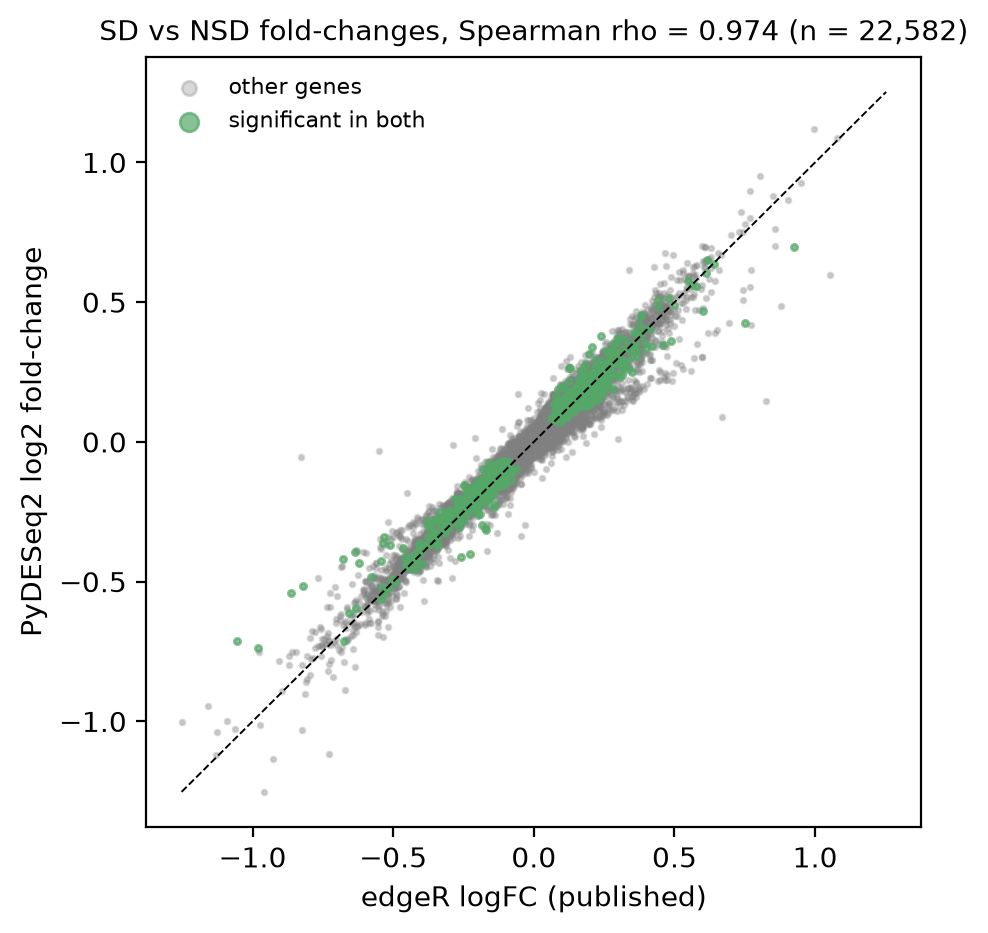
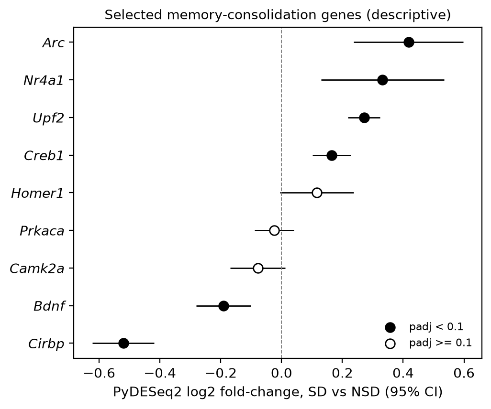

<!-- README.md is generated from README.template.md by `make readme`. Edit the template, not README.md. -->
# Sleep deprivation and the mouse hippocampal transcriptome: an independent PyDESeq2 reanalysis

**Question:** does an independent Python reanalysis with a different statistical method (PyDESeq2 instead of edgeR) reproduce the hippocampal gene expression changes reported after 5 hours of sleep deprivation in mice by Gaine et al. (2021)?

## Result in brief

- Same 22,582 genes the authors tested, same model terms (`~ batch + exposure`), 9 sleep-deprived (SD) vs 9 undisturbed (NSD) mice.
- The published edgeR analysis reported 1,146 genes at FDR < 0.1; PyDESeq2 finds 1,521.
- PyDESeq2 recovers 886 of the 1,146 published genes (77.3%), and 100.0% of those shared genes change in the same direction.
- Fold-changes agree closely across all genes: Spearman rho = 0.974 (n = 22,582).

## Why the two analyses differ

- **Statistical test.** PyDESeq2 uses the DESeq2 Wald test. The authors used edgeR's quasi-likelihood F-test (`glmQLFit(..., robust=TRUE)`), which accounts for uncertainty in dispersion estimates and is generally more conservative.
- **Normalization.** PyDESeq2 uses median-of-ratios size factors. The authors used EDASeq GC-content normalization.
- **Filtering.** PyDESeq2 sets the adjusted p-value to missing for 7,005 low-information genes (independent filtering or outlier handling); these are counted as not significant. Of the 260 published genes PyDESeq2 does not recover, 73 (28.1%) fall in this group; the other 187 were tested but did not reach FDR < 0.1, which reflects the different test and normalization.

## Memory-consolidation genes (descriptive)

Seven genes from my sleep and memory consolidation literature review (Arc, Nr4a1, Bdnf, Creb1, Camk2a, Prkaca, Homer1) plus the paper's top hits Cirbp and Upf2, shown as log2 fold-change with 95% confidence intervals. These genes were chosen after the data were published, so the figure is descriptive and is not a new hypothesis test. For example, Arc is higher after sleep deprivation (log2 fold-change 0.418, padj 0.00047) and Cirbp is lower (-0.52, padj 7.1e-20).

**Open question (Homer1).** In the same lab's earlier microarray study (PMID 22930738, GEO GSE33302), the most significant probe, 1436387_at, is annotated to two genes (`C330006P03Rik///Homer1`) and was decreased after sleep deprivation. At the gene level in this RNA-seq data, Homer1 is not significantly changed (log2 fold-change 0.116, padj 0.28). The reason for this mismatch is not established here.

## Limitations

- Processed counts from the authors were used; raw reads were not realigned.
- One dataset of male mice, whole hippocampus, so no sex or cell-type resolution.
- Agreement between two methods measures computational reproducibility, not biological validation.
- The memory-gene panel is post hoc and descriptive.
- Exact counts can shift slightly with package versions. This README was generated with Python 3.12.3, PyDESeq2 0.5.4, pandas 3.0.6, numpy 2.5.3, and scipy 1.18.1; `requirements.txt` pins every package.

## Reproduce

Requires Python 3.12+ (the pinned requirements need it), GNU Make 4.3+, and internet access. On Windows, use WSL. Clone this repository, then:

~~~
python3 -m venv .venv && source .venv/bin/activate
pip install -r requirements.txt
make all    # downloads data, runs the analysis, writes results/ and figures/, regenerates README.md, runs tests
~~~

Data are downloaded at runtime from the authors' repository and are not redistributed here.

## Citations

- Gaine ME, Bahl E, Chatterjee S, Michaelson JJ, Abel T, Lyons LC. Altered hippocampal transcriptome dynamics following sleep deprivation. Molecular Brain. 2021;14:125. doi:10.1186/s13041-021-00835-1
- Processed data and original R code: https://github.com/ethanbahl/gaine2021_sleepdeprivation
- Muzellec B, Teleńczuk M, Cabeli V, Andreux M. PyDESeq2: a python package for bulk RNA-seq differential expression analysis. Bioinformatics. 2023. doi:10.1093/bioinformatics/btad547
- Love MI, Huber W, Anders S. Moderated estimation of fold change and dispersion for RNA-seq data with DESeq2. Genome Biology. 2014;15:550. doi:10.1186/s13059-014-0550-8

## License

Code: MIT (see `LICENSE`). The data belong to their original authors.
